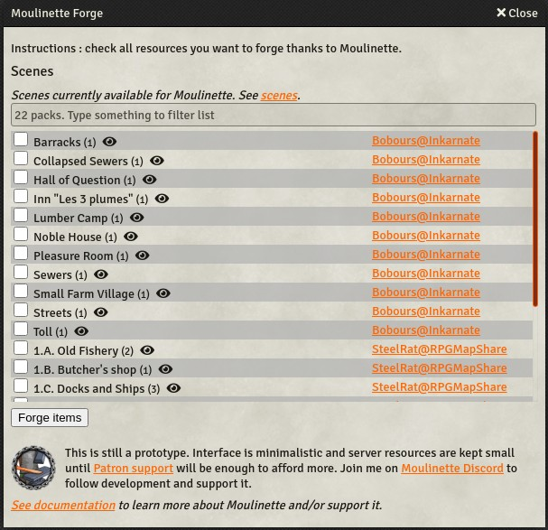
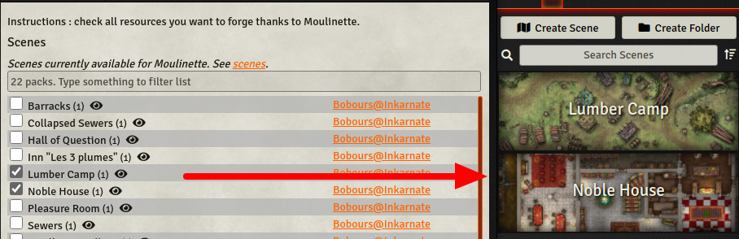
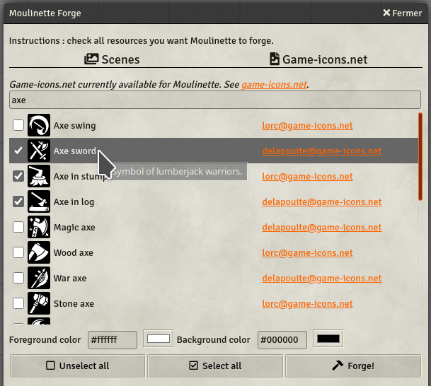
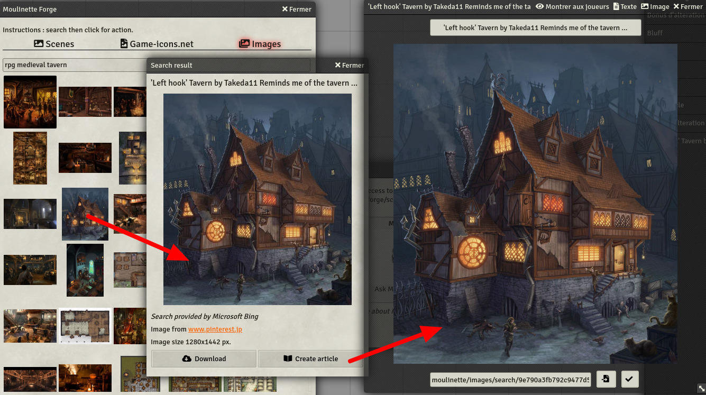
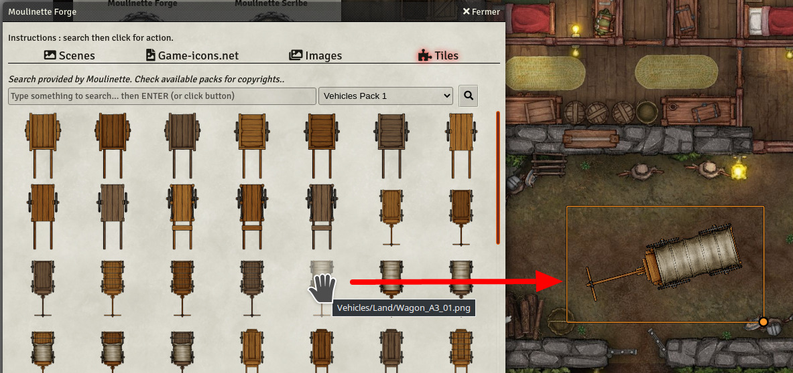
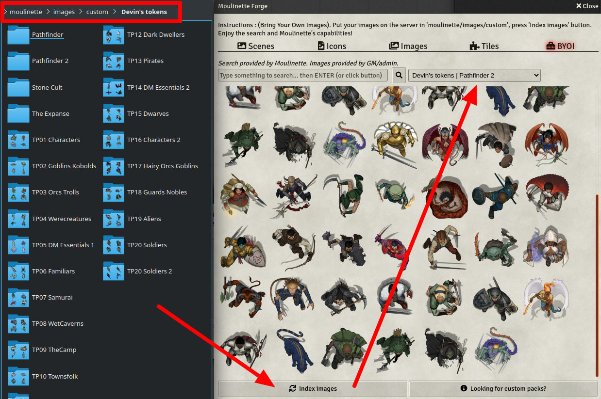
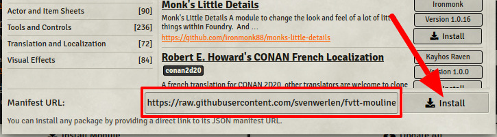

# Moulinette for Foundry VTT

   

[Moulinette](https://github.com/SvenWerlen/moulinette) is a set of tools for importing packs of scenes, images, playlists prepared by the community.

* [Moulinette Forge - Scenes](#forge): import scenes into your world. Share your scenes with the community.
* [Moulinette Forge - Game icons](#forge-game): search and import game icons from <a href="https://game-icons.net/" target="_blank">game-icons.net</a>.
* [Moulinette Forge - Image search](#forge-search): search images and generate articles.
* [Moulinette Forge - Tiles](#forge-tiles): search tiles and drop them on your maps.
* [Moulinette Forge - BYOI](#forge-byoi): bring your own images and let Moulinette manage them for you.
* [Moulinette Scribe](#scribe): install and apply translations.
* [Install the module](#install): install the module on your Foundry VTT server.
* [Support me on Patreon](#support)

## <a name="forge"/>Moulinette Forge - Scenes

You're a GM (game master) preparing a new scenario? Moulinette Forge lets you browse a catalog of scenes shared by the community. 
* Search in the catalog
* Have a look at the preview
* Check the scenes you want to import
* Forge!

You are a map designer and have prepared some scenes you'd like to share? Moulinette facilitates the process of sharing scenes with others.
* Right click on your scenes
* Choose "Share the scene with Moulinette"
* Fill the form
* Submit! 
* It will show up in the forge after the review process is completed!

## <a name="forge-game"/>Moulinette Forge - Game icons

You need icons for your game (actions, items, etc.). 
* Search <a href="https://game-icons.net/" target="_blank">game-icons.net</a> catalog
* Check the icons you want to import
* Choose your favorite colors (foreground/background)
* Forge!

## <a name="forge-search"/>Moulinette Forge - Image search

You need images to enrich your game/campaign 
* Search using <a href="https://www.bing.com" target="_blank">bing.com</a> engine
* Preview the image
* Download or generate a journal article
* Forge!

## <a name="forge-tiles"/>Moulinette Forge - Tiles

You want to add tiles on your maps?
* Search using Moulinette engine
* See publisher and license (generally [CC BY-NC-SA 4.0](https://creativecommons.org/licenses/by-nc-sa/4.0))
* Drag and drop tiles 
* Voilà!

## <a name="forge-byoi"/>Moulinette Forge - Bring your own images (BYOI)

You created or downloaded some tokens/assets you'd like Moulinette to manage for you?
* Put them in `moulinette/images/custom` folder.
* Make sure to have at least a 2-depth structure (1. Publisher, 2. Pack, 3+ Images)
* Index images
* Moulinette provides you now the same features as for tiles (see above)

## <a name="scribe"/>Moulinette Scribe

Scribe is intended for non-english communities. Moulinette Scribe lets you browse a catalog of available translations maintained by the communities
* Search in the catalog (use smart filters!)
* Check the translations you want to install
* Scribe!

### Benefits
* Quick and easy search for available translations
* Doesn't require the installation of additional modules
* Supports Core & Babele translations
* Can be updated without exiting your worlds nor restarting the server
* Translators can provide translations for any module/system without having to create a module or ask the developer to include the translations
* Translations can be hosted anywhere (GitHub, GitLab, public website, etc.)

## <a name="install"/>Install the module

To **manually install** the module, follow these instructions:

1. Start FVTT and browse to the Game Modules tab in the Configuration and Setup menu
2. Select the Install Module button and enter the following URL: https://raw.githubusercontent.com/svenwerlen/fvtt-moulinette/master/module.json
3. Click Install and wait for installation to complete 

## <a name="openUI"/>Open Moulinette interface

There are 3 different ways to open the user intervace:
* Shortcut : `CTRL + M`
* Button available in the `Parameters` tab
* Macro avaiable in the Moulinette macros compendium

### Why Moulinette is not available in the official list ?

Unfortunately and although Moulinette makes sure to obtain all authorizations from the authors before referring resources in the catalogs, 
Foundry VTT considers that this module intents to distribute copyrighted content without license. Therefore, you might not promote
Moulinette in any forum of Foundry VTT. Spread the word!

## <a name="support"/>Support me on Patreon

If you like my work and want to support me, consider becoming a patreon!

[https://www.patreon.com/moulinette](https://www.patreon.com/moulinette)

You can also join [Moulinette Discord](https://discord.gg/xg3dcMQfP2)
