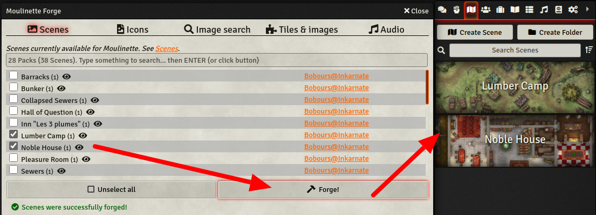
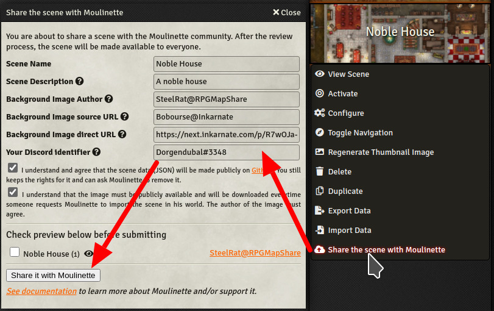

# Moulinette for Foundry VTT

Moulinette is a set of tools for importing packs of scenes, images, playlists prepared by the community.

### Moulinette Forge

You're a GM (game master) preparing a new scenario? Moulinette Forge lets you browse a catalog of scenes shared by the community. 
* Search in the catalog
* Have a look at the preview
* Check the scenes you like to import
* Forge!

You are a map designer and have prepared some scenes you'd like to share? Moulinette facilitates the process of sharing scenes with others.
* Right click on your scenes
* Choose "Share the scene with Moulinette"
* Fill the form
* Submit! 
* It will show up in the forge after the review process is completed!

### Install the module

To install the module, simply install *Moulinette for Foundry VTT* from the offical list of Foundry VTT modules

To **manually install** the module, follow these instructions:

1. Start FVTT and browse to the Game Modules tab in the Configuration and Setup menu
2. Select the Install Module button and enter the following URL: https://raw.githubusercontent.com/svenwerlen/fvtt-moulinette/master/module.json
3. Click Install and wait for installation to complete 
